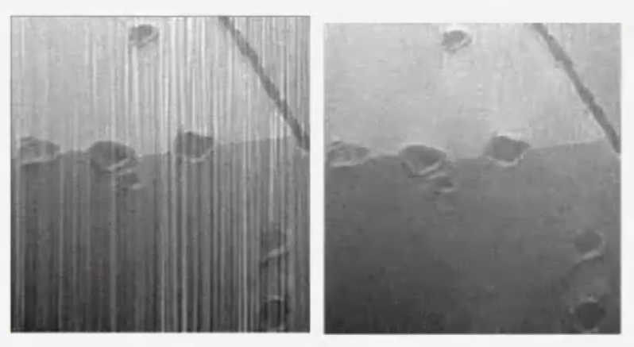
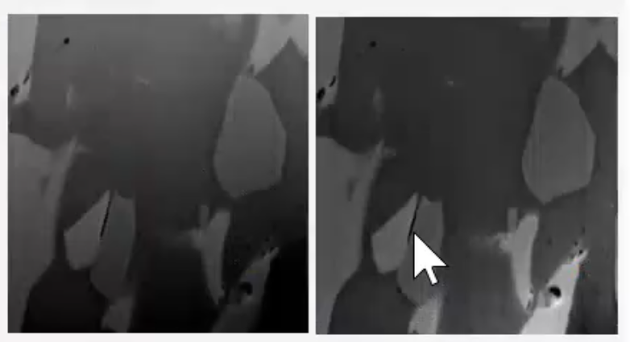

# Amira

## 数据格式

电镜：支持rec，mrc格式, 对于ET图像，可以读入mdoc文件

## 图像预处理

1. 去噪
2.   去尾影
3. 图像增强（提高衬度？）

不同设备具有不同的问题，电镜伴随分辨率越高，会有很多密集小的噪点，可以通过高斯滤波，各向异性扩散（Anisotropic diffusion），通过深度学习的方式去噪

电镜数据存在背景不均一的问题，Amira可以做矫正。

CT数据可能会有环形尾影、映射线尾影，Amira可以做矫正。

## 图像可视化

2D、3D。剖面

## 提取关心结构

自动、半自动、手动、深度学习的方式

### Membrane enhancement tool 膜增强

可以通过膜增强，把图像断断续续的部分连起来。通过加权的方式，可以把弱信号也提取出来。

好处：当图像中有很多比如核糖体之类的我们不感兴趣的结构时，把图像先过膜增强，再过提取关心结构，就可以避免图像混杂的情况。

### Structure enhancement tool 结构增强

​	可以通过结构增强，提取出图像中，固定大小的点状或者球状结构，2D、3D都可以进行增强

### Local Thresholding 阈值提取

对于骨骼等CT图片，不同结构的灰度还是有一定差异的，因此可以利用这一特点，直接划分一个灰度阈值，对图像进行提取。

### Watershed segmentation 分水岭

用划线的方法，人为地区分开背景和我们感兴趣的结构，过分水岭算法，就可以提取出目标结构。

### machine learning基于纹理进行分割

U-net局部图像分割

### Segmentation deep-learning

相当于在训练过程中提取出多个特征结构

### Filamentous structures analysis纤维结构提取

例如提取带有噪声图像的微管蛋白结构

### Materials deformation analysis: Digital Volume Correlation形变分析模块

可以出应力分布

## 提取结构信息（量化）

比如：细胞的体积面积、长度、等向半径、周长、一些统计的信息

## 结果导出

支持高质量截图

# 问题

## 双束电镜：会有束条纹的问题

## 背景问题：区域明暗不统一

